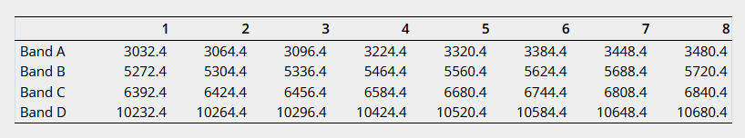

# RFImonitoring-tool

RFI monitoring is always an essential task. A software tool is presented to monitor spectral power levels using the ”mark5access” spectra data from each scan. It is a straight forward method to present basic RFI information on-the-fly during or directly after a session.
It automatically generates the following:

  - GNU spectra plots for each scan, helping operators to identify missing phase calibration signals
  - Spectrograms (waterfall plots) of the whole session as a sequence of color plots from single plot data, including pointing directions for each timestamp, extracted from the session summary file
  - Skyplots of the whole session,  which assigns the RFI power levels to their respective sky positions

 

### Spectral data:

Currently, the tool has been implemented for VGOS antennas, which record 8 fixed frequency bands with 512 MHz bandwidth each (4 bands horizontal and 4 bands vertical polarized). Each band contains specific phase calibration signals, which look like a comb over the whole band. Each band is split into 32 MHz channels which are then recorded on a Mark6 data recorder. 200 MB of each multi-threaded file for a single scan is copied after each recording. Single band files are produced from the multi-threaded file chunk using the Mark6 tool „dqa“. These separated files are used to create power spectra numbers using „m5spec“ from the „mark5access“ library of the DiFX software (see W. Brisken: A Guide to the DiFX Software Correlator), for all 16 channels per band and for all bands. The following figure shows the precise band frequencies that have been used ([M. H. Xu et al., 2022](https://www.aanda.org/articles/aa/full_html/2022/07/aa40840-21/aa40840-21.html#T3)):

Some example datasets can be found on [this Webserver](https://vlbisysmon.evlbi.wettzell.de/monitoring_archive/jumpingjivestud/).

 

### Get started and run the code:
Requirements: `pip install -r requirements.txt`.

The tool is using a various combinations of command argument sets as inputs. Hence, the `main.py` - script shall be run with all the chosen command arguments through the terminal. Further details and explanations about the execution commands, some sample execution sets, and other parameters to take into consideration are given in the appended **main_readme.pdf** - file.

